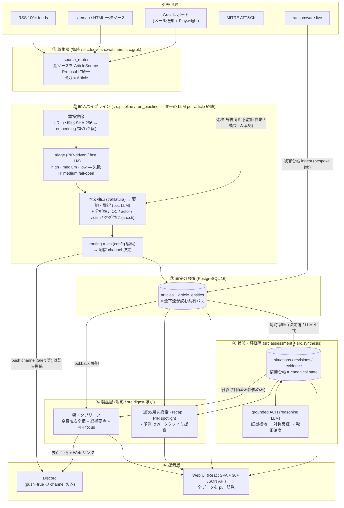
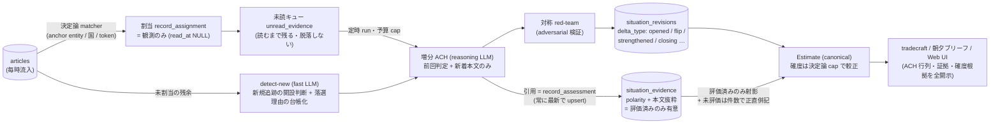
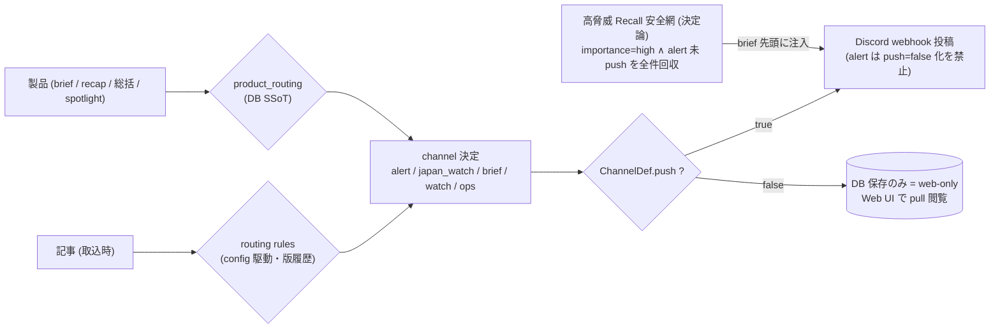

# Kuebiko (久延毘古)

毎朝 **06:30 JST** に CTI (Cyber Threat Intelligence) ブリーフィングを自動生成し、
Discord に BLUF 形式で投稿する個人運用パイプライン。常駐 Web UI (React SPA) から
設定編集・ログ可視化・プロンプトチューニング・即時実行・スケジューラ管理・情勢分析を行える。

> **個人運用向け設計** (single-analyst)。フル機能 UI は `127.0.0.1` のみバインドし、
> 外部公開しない (閲覧専用インスタンスのみ Cloudflare Tunnel + Cloudflare Access 経由の
> モバイル閲覧を許容)。

---

## 概要

- **目的**: 日本の CTI 担当者が、毎朝の脅威動向把握に費やす時間を最小化する
- **利用者**: 単独運用 (single-analyst, single-Mac)
- **稼働環境**: MacBook Pro を常駐サーバとし、ホストネイティブ Ollama (Metal 加速) +
  Docker コンテナ (FastAPI + APScheduler + PostgreSQL) のハイブリッド構成
- **原則**: 解析・要約・翻訳は**既定でローカル LLM** で完結。外部 LLM (Anthropic) は利用者が
  モデルティアへ明示割当した場合のみ使用 (ツールが勝手に外部送信しない。embedding は常にローカル)。
  **中国系 LLM / Embedding は不使用** (中華系 APT を主要監視対象とする CTI 業務の
  サプライチェーン要件)

### データフロー

```
自前 RSS フィード (100+)  ┐
Web スクレイパ (sitemap/HTML) ├─► 本文抽出 ─► 重複排除 ─► ローカル LLM ─► BLUF 整形 ─► 配信
Grok レポート (IMAP+Playwright) ┘  (trafilatura)   (URL hash +      (能力ティア)     (チャンネル振り分け)
                                                    ベクトル類似度)
```

配信は channel の `push` 属性で分岐する: **アラート / 日次ブリーフは Discord push**、
watch 等の高頻度チャンネルは **Web UI 閲覧専用** (保存のみ)。

LLM は**能力ティア**で使い分ける (下記「モデル設定」):
per-article 要約・triage・抽出は **fast ティア (MoE, 高速)**、状況総括ナラティブや ACH 等の
深い推論は **reasoning ティア (Dense, 高品質)**、意味的重複排除は **embedding ティア**。

---

## 主な機能

- **自動ブリーフィング**: 朝 (06:30) の通読ブリーフ + 夕方 (19:30) の状況更新を Discord に投稿
- **マルチソース収集**: 自前 RSS (`config/feeds.yaml`) / sitemap・HTML スクレイパ
  (`watchers.yaml` / `scrapers.yaml`) / Grok レポート (メール通知 → Playwright 取得) を統一処理
- **重複排除**: URL 正規化 + SHA-256、および Embedding によるベクトルコサイン類似度 (多言語横断)
- **CTI メタデータ**: 脅威アクター正規化 (エイリアス辞書 + MITRE ATT&CK 週次同期)、IOC 抽出
  (regex + LLM verifier)、STIX 2.1 エクスポート、Diamond Model の意図軸
- **PIR 駆動**: Priority Intelligence Requirements を first-class entity として扱い、
  triage の重要度評価・状況総括・PIR スポットライト/デイリーフォーカスを駆動
- **状況総括 (synthesis)**: 証拠接地 → ACH → 対称 adversarial → 較正確度 → narrative の
  台帳駆動アセスメント (日次 / 週次 / 月次)
- **情勢分析 UI**: Intel Graph (状況総括・地図・タイムライン・アクターグラフ)、
  サイバー×地政学相関、被害状況コレクタ
- **本文の日本語全訳**: 記事詳細のオンデマンド翻訳 + 毎時の自動バックログ翻訳。
  チャンク単位の resumable 設計で長文・失敗・時間切れから続きを再開
- **運用コンソール**: 実行履歴・ライブログ (SSE)、背景ジョブの統一制御面、
  死活監視 (各対象画面 + ダッシュボード widget に統合)、
  情報フロー (ルーティング/配信) の可視化と調整
- **モバイル閲覧**: 閲覧専用インスタンス (write は middleware で 403) を Cloudflare Tunnel で
  公開。公開面は 3 層 — 匿名=閲覧のみ / Cloudflare Access 認証=運用系 read + ジョブ即時実行 /
  それ以外の write=ローカル専用 (認証イベントは DB に監査記録)

---

## アーキテクチャ

```
[macOS host]
  ├── Ollama (Metal 加速、ホストネイティブ)                 ← :11434
  │
  ├── Docker: kuebiko        (フル機能インスタンス)     ← 127.0.0.1:8001 → :8000
  │     └─ FastAPI (React SPA を serve) + APScheduler (TZ=Asia/Tokyo)
  ├── Docker: readonly (閲覧専用, READ_ONLY=1)  ← 127.0.0.1:8002 → :8000
  │     └─ write API は middleware が 403 で block
  ├── Docker: postgres        (PostgreSQL 16, named volume)
  ├── Docker: backup          (日次 pg_dump, 14 日 rotation)
  └── Docker: tunnel   (Cloudflare quick/named tunnel → :8002)
```

- **UI**: React SPA (`frontend/`, Vite build → `frontend/dist`) + FastAPI JSON API (`src/ui/api/`)
- **DB**: **PostgreSQL 16** (メタデータ + run 履歴 + ベクトルは BYTEA + numpy 全件コサイン)。
  SQLite は dev/tests の fallback のみ
- **運用 config は DB (config_store) が SSoT**、yaml は初回 seed 専用、版履歴つき
  (稼働アプリが開発 git にコミットする anti-pattern は廃止)
- 非 root 実行 (`USER 1001:1001`)、シークレットは `.env` + 機密マスク

詳細は [CLAUDE.md](./CLAUDE.md) と [docs/](./docs/) を参照。

---

## ツールの構造 (モジュールと情報フロー)

> 2026-07-16 の全モジュール棚卸しに基づく詳細地図。設計の背骨は **単方向の情報フロー** —
> **収集 (観測) → articles (事実) → 評価 (判断) → 製品 (射影) → 提示 (Web/Discord)**。
> 逆方向の流れは「人の承認を通る提案」(タクソノミ/アクター辞書/PIR 編集) だけに限定される。
> もう 1 つの背骨は **SSoT の明示** — どのデータも「正」となる置き場が 1 つに決められている
> (後述のデータストア表)。

### 全体情報フロー (一枚図)



### モジュール一覧 (パッケージ = モジュール単位の責務)

| 層 | パッケージ | 責務 | 主な入力 → 出力 |
|---|---|---|---|
| 収集 | `src/tools` | 汎用 I/O アダプタ: RSS fetcher / IMAP / 本文抽出 / URL 正規化 / source_router / Discord webhook / LLM・embedding クライアント / 能力ティア (model_tiers) / channel registry | 外部ソース → `Article` |
| 収集 | `src/watchers` | RSS の無い一次ソースの sitemap/HTML scraper registry (+ bespoke Playwright 系) | Web → `Article` |
| 収集 | `src/grok` | Grok レポート取込 (メール URL → DOM 抽出 → JSONL → tweet 単位 briefing) | メール → `Article` → `BriefingMessage` |
| 収集 | `src/sources` | ソース宣言の SSoT seam (yaml seed → DB config_store) + ransomware.live ingest | yaml/DB → 有効ソース一覧 |
| 取込 | `src/pipeline` | 取込の一本道 (orchestrator): 取得 → dedup → triage → 要約 → enrich → routing → 投稿 → 永続化。dispatch が pipeline 種別を振り分け | `Article` → `articles` 行 + Discord 投稿 |
| 意味付け | `src/cti` | CTI ドメイン知識 (約 40 モジュール): triage/routing 規則・IOC 抽出+LLM 検証・actor 正規化+MITRE 同期・主題アクター判定 (subject_actor、言及≠主題)・国家系 doctrine (日本標的/事前配置/非国家系 family)・分析軸 (intent/技術/日付)・japan_relevance・victim/sector 正規化・STIX 2.1・dedup_key・地理 geocoder | 記事本文 → 構造化メタデータ |
| 意味付け | `src/pir` | PIR (情報要求) の compile (自然文→構造) / 記事×PIR 評価 (inline + 夜間 rebuild、actors/actor_nations は主題ゲート + 国家系限定) / synthesis への文脈供給 | PIR 定義 → `article_entities(pir)` |
| 状態・評価 | `src/assessment` | **情勢台帳** (situations/revisions/evidence): 決定論割当 → 未読キュー → 増分 ACH → 対称検証 → revision 永続化 → Estimate 射影。常設情報要求 (standing posture)・salience・予測 I&W lifecycle | `articles` → 台帳 → `Estimate` |
| 状態・評価 | `src/synthesis` | 状況総括の生成: grounded (証拠接地 ACH / adversarial / 較正確度 / narrative 射影) + 収集完了後の auto-trigger | 台帳/記事 → `status_synthesis` |
| 製品 | `src/digest` | 朝・夕ブリーフ合成 (高脅威 Recall 安全網 + 総括要点 + PIR daily focus + Web リンク)・週次 recap (deep-dive) | DB 集約 → `daily_briefs` + Discord 1 通 |
| 製品 | `src/spotlight` / `src/taxonomy` / `src/forecast` | PIR 縦断 narrative (週次) / 分類辞書の改善提案 (人承認キュー) / 予測分析の API サービス | DB → 各テーブル |
| 対話 | `src/assistant` / `src/search` | 分析チャット (plan→接地回答、read-only ツール) / entity facet 検索 | 質問 → 接地回答 / 検索結果 |
| 提示 | `src/ui` + `frontend/` | FastAPI (30+ JSON API + WebSocket) + React SPA (ダッシュボード / News / Intel Graph / 台帳 / 情報フロー / ジョブ管理 / 設定編集)。脅威アクターのミッション脅威評価 (関連度×能力の透明ティア、90d 決定論) + 週次供給網監査 (fill-rate / routing ルール発火) | DB → 画面 |
| 基盤 | `src/storage` | PG16 (SQLite fallback) への統一アクセス: run_history facade (runs/articles/dedup/synthesis/knowledge) + config_store (運用 config の DB SSoT・版履歴) + dialect 自動翻訳 | — |
| 基盤 | `src/scheduler` | APScheduler ラッパ + JobDef registry (pipeline/bespoke/reactive の統一制御面、メタ=コード所有・schedule=DB) | — |

### ① 取込パイプラインのステップ (`run_pipeline` — 収集系 3 pipeline が通る唯一の経路)

| # | ステップ | モジュール | 渡されるデータ / 分岐 |
|---|---|---|---|
| 1 | 取得 | `source_router` → 各 `ArticleSource` | → `list[Article]`。RSS は取得段階で seen URL を除外 (収集飢餓防止)。feed 死活を `source_fetch_health` に記録 |
| 2 | URL dedup | `pipeline/filters` + `dedup_seen_urls` | URL 正規化 SHA-256 のバルク照合。重複は終端 |
| 3 | 意味的 dedup | `filters` + `article_embeddings` | hard (0.92/168h) → cluster (0.82/48h) → batch 内。embedding 未設定時は graceful 無効 |
| 4 | triage | `tools/article_triage` (fast LLM) | PIR 定義を動的注入して high/medium/low。keep 対象外は既読化=終端。**LLM 失敗は medium fail-open (Recall 優先)** |
| 5 | 記事処理 | `pipeline/briefing` | 本文抽出 → 要約・翻訳 (`SummaryOutput`) → 論調・分析軸・IOC (regex+LLM 検証)・actor 辞書照合 → `BriefingMessage` |
| 6 | routing | `cti/routing_signals` → `cti/router` | `RoutingSignals` → `RoutingDecision` (channel + rule_id + 理由)。優先層 (japan/KEV/APT) → 衛生層 → importance 層 |
| 7 | 投稿 | `pipeline/publish` + `discord_publisher` | 投稿前 dedup ゲート (dedup_key / CVE / content) → **channel の `push=false` なら Discord せず DB のみ (web-only)** → STIX 添付・続報アノテート |
| 8 | 永続化 | `pipeline/persistence` | 永続化直前に**主題アクター判定** (title 決定論 + summarizer 既存 primary_actor の辞書解決、言及≠主題) を一元実行 → `articles` (importance/routing 判定/分析軸/victim/subject_actor…) + `article_entities` (actor/cve/ioc/malware/pir/mention…) + 本文 |
| 9 | 後処理 | `synthesis/auto_trigger` | 投稿ありなら daily 総括を near-realtime 更新 (debounce 6h) |

> **entity の詳細処理 (収集→抽出→分析→消費の内部・entity_type 全目録・mention/subject ゲート
> 適用状況・既知ギャップ)** は [docs/entity_pipeline_inventory.md](docs/entity_pipeline_inventory.md)
> に file:line 単位で棚卸し済み (2026-07-29)。`article_entities` は言及 (mention)、
> `articles.subject_actor_ids` は主語 (subject) で別テーブル・別経路。

### ④ 状態・評価層 (情勢台帳 — 判断の canonical state)

記事は「事実」、台帳は「判断」。両者は状態として分離される (観測 ≠ 判断)。



証拠 1 行の状態遷移 (2026-07-16 状態分離):
**割当 (観測・未読)** → **読了 (prompt に供給・引用なし)** → **評価済み (ACH 引用・polarity/抜粋が有意)**。
UI は評価済みを「接地証拠 (支持/反証/中立)」、それ以外を「未評価の割当」として区別表示する。

### ⑤⑥ 配信の決定 (Discord push / web-only)



- **Discord = 警告 + 日次ブリーフ (push)** / **Web = 状況認識の全量 (pull)** という通知モデル。
- 分類 (importance) と配信 (channel/push) の断絶は高脅威安全網が保証する
  (high は必ず日次通読に載る)。

### 背景ジョブ一覧 (JobDef registry が SSoT / UI「実行管理」で制御)

> **実行時刻の SSoT は DB (UI「実行管理」の schedule)** — 本表は既定サイクルの目安のみ記す
> (時刻を文書に複製すると実スケジュールと乖離するため)。

| ジョブ | 種別 | 既定サイクル | 実体 | 出力先 |
|---|---|---|---|---|
| direct-rss-fetch | pipeline | 毎時 | run_pipeline (rss) | articles + 即時 Discord |
| web-scraper-watchers | pipeline | 毎時 | run_pipeline (scraper cluster) | 同上 |
| body-refetch-backlog | bespoke | 毎時 | 切り株本文の全文再取得 + 再エンリッチ | articles (body 差替え) |
| body-translate-backlog | bespoke | 毎時 | 未訳本文の自動日本語訳 (チャンク resumable) | articles.body_ja |
| pir-judge-hourly | bespoke | 毎時 | PIR 主題判定の増分評価 | article_entities (pir) |
| grok-briefing | pipeline | 朝 | run_pipeline (grok_email) | articles + Discord |
| morning-brief | pipeline (heavy) | 朝 06:30 帯 | 総括 + PIR focus + 高脅威 → 1 通 | status_synthesis / daily_briefs / #brief |
| evening-brief | pipeline (heavy) | 夕 19:30 帯 | 総括 + 高脅威 (PIR なし) | 同上 |
| ransomware-live-ingest | bespoke | 3h 毎 | 被害公表 ingest | articles (JP は #japan_watch) |
| daily-maintenance | bespoke | 日次 (深夜帯) | retention purge (90 日) ほか DB 保守 | — |
| pir-entity-rebuild | bespoke | 日次 (深夜帯) | 記事×PIR の夜間 reconcile | article_entities (pir) |
| ledger-deep-review | bespoke | 日次 (深夜帯) | 台帳 ACH の夜間精査 (再評価飢餓の解消) | situation_revisions |
| actor-history-distill | bespoke | 日次 (深夜帯) | アクター行動史の月次期間行を蒸留 | actor_observed_profile |
| ua-health-check | bespoke | 日次 (深夜帯) | 取得 UA の自己修復 (block されたソースの再試験) | fetch_policy 状態 |
| daily-heartbeat | bespoke | 朝 | 稼働サマリ + 沈黙 feed + 被覆番兵 | #ops (dead-man's switch) |
| weekly-recap | pipeline | 週次 (深夜帯) | deep-dive digest (168h) | weekly_recaps / #brief |
| weekly-status-synthesis | pipeline | 週次 (深夜帯) | 週次総括 + 予測 indicator snapshot | status_synthesis / forecast_indicators / #brief |
| monthly-status-synthesis | pipeline | 月次 (深夜帯) | 月次総括 | status_synthesis / #brief |
| pir-spotlight | pipeline | 週次 (深夜帯) | PIR 縦断 narrative | pir_spotlight (web-only) |
| weekly-taxonomy-review | pipeline | 週次 (深夜帯) | 分類辞書の改善提案 | taxonomy_review_proposals (UI 承認) |
| mitre-actor-sync | pipeline | 週次 (深夜帯) | MITRE → actor 辞書同期 (追加=自動 / 衝突=人承認) | actor_aliases.yaml + actor_update_proposals |
| weekly-fill-rate-audit | bespoke | 週次 (朝) | タグ被覆 + routing ルール発火の急落・空振り検知 (決定論) | #ops (必ず 1 通) |
| job-recovery-watchdog | bespoke | 30 分毎 | 周期ジョブの成功実績を検査し自動再実行 (3 回 cap) | — |
| auto-trigger-synthesis | reactive | 収集完了後 (debounce 6h) | daily 総括の near-realtime 更新 | status_synthesis |

収集ジョブは heavy ジョブ (brief/総括) の実行区間と重なるときだけ動的に抑止される。
readonly インスタンスは scheduler を起動しない (二重発火防止)。

### データストアと SSoT

| データ | 置き場 (SSoT) | 備考 |
|---|---|---|
| 記事の事実 + 分析メタデータ | PG `articles` / `article_entities` / `article_embeddings` / `dedup_seen_urls` | 全下流の共有バス |
| 実行履歴 + ライブログ | PG `runs` / `run_logs` | subprocess stdout を 1 行ずつ永続化 (SSE/WS 配信) |
| 情勢の判断 (canonical) | PG `situations` / `situation_revisions` / `situation_evidence` / `situation_relations` / `situation_detection_log` | 報告はすべてこの射影 |
| 製品スナップショット | PG `status_synthesis` / `daily_briefs` / `weekly_recaps` / `pir_spotlight` / `forecast_indicators` ほか | Web が pull 描画 |
| 人承認キュー | PG `taxonomy_review_proposals` / `actor_update_proposals` | 逆流はここだけ (人が裁く) |
| 運用 config (routing/channels/product/PIR/sources/model tiers/match lists/レイアウト等) | PG `config_store` + `app_config_versions` (版履歴・revert) | yaml は初回 seed 専用。**稼働アプリは git を触らない** |
| ツール同梱の知識辞書 | `config/actor_aliases.yaml` (git 管理) ほか | MITRE 同期が atomic write (+.bak)。禁止モデル denylist はコード所有 |
| シークレット | `.env` (UI 編集はマスク + atomic write) | ログ/レスポンスは機密マスク二重防御 |

### 設計原則 (全体ロジックの不変条件) と評価

全体棚卸し (2026-07-16) の結論 — 情報フローは以下の不変条件で貫かれており、全体ロジックは健全:

1. **単方向フロー**: 事実 → 判断 → 射影。下流が上流を書き換えない (逆流は人承認キューのみ)。
2. **観測と判断は別状態**: 取込は決定論 + fail-open、評価は証拠接地 ACH。証拠台帳も
   割当/読了/評価を状態として分離。
3. **SSoT の一元化**: 運用 config は DB (版履歴)、ジョブメタと安全装置 (モデル denylist・
   channel fail-safe) はコード所有。同じ意味のデータを二重に持たない。
4. **Recall の保証**: triage fail-open / 収集 seen 除外の順序 / 未読キューの無脱落 /
   高脅威安全網 (分類と配信の意味的整合)。
5. **正直さの強制**: 接地件数・未評価件数・確度上限・落選理由・沈黙 feed を隠さず開示。
   最終保証は「機械が客観」ではなく**推論の可視化** (証拠・ACH 行列を UI で人間が検められる)。
6. **物理的な安全境界**: 認証ではなく構造で守る — 127.0.0.1 バインド、write 不能な
   readonly インスタンスのみ外部公開、LLM は全てローカル。

既知の限界 (意図的な受容):
単一ノード運用 (PG / Ollama が単一障害点、日次 pg_dump で回復) / LLM 処理は
30 分 timeout 予算内の直列実行 / 認証なし (境界防御のみ) / robots.txt 未尊重 (個人利用・
要約+引用 URL のみ配信)。

---

## 必要環境

| 項目 | 内容 |
|---|---|
| OS | macOS (Apple Silicon 推奨) |
| Python | 3.12+ / パッケージ管理は [uv](https://docs.astral.sh/uv/) |
| フロントエンド | Node.js + Vite (React SPA) |
| LLM ランタイム | [Ollama](https://ollama.com/) (ホストネイティブ、Metal) |
| コンテナ | [OrbStack](https://orbstack.dev/) 推奨 / Colima / Docker Desktop |
| DB | PostgreSQL 16 (docker compose の `postgres` service) |
| ブラウザ自動化 | Playwright for Python (Grok 取得用) |

### 推奨モデル (能力ティア既定)

| ティア | 既定モデル | 用途 |
|---|---|---|
| `reasoning` | `gemma4:31b` (Dense) | 状況総括 narrative / ACH / adversarial / PIR spotlight |
| `fast` | `gemma4:26b` (MoE) | 記事要約・翻訳 / triage / detect-new / 抽出 / 対話系 |
| `embedding` | `snowflake-arctic-embed2` | 意味的重複排除・検索 |

> 中国系モデル (Qwen / DeepSeek / GLM / bge- / m3e 等) は 3 層 whitelist で除外 (CLAUDE.md §4)。

---

## クイックスタート

```bash
# 1. 取得
git clone https://github.com/kamonegi13/kuebiko.git kuebiko
cd kuebiko

# 2. ホスト側 Ollama とモデル
brew install ollama && brew services start ollama
ollama pull gemma4:31b
ollama pull gemma4:26b
ollama pull snowflake-arctic-embed2

# 3. 依存 (UI 開発・テスト用の venv)
curl -LsSf https://astral.sh/uv/install.sh | sh
uv sync

# 4. 雛形生成 → .env に認証情報 (IMAP / Discord webhook / DB パスワード等) を記入
bash scripts/setup.sh
vim .env

# 5. ビルド & 起動 (app + readonly のみ。tunnel を触らない = URL 安定)
docker compose up -d --build kuebiko readonly

# 6. 管理画面
open http://127.0.0.1:8001/

# 7. (任意) Grok 取得の認証 cookie を普段使い Chrome から抽出
#    ※ Playwright ログインは Cloudflare に弾かれるため cookie 抽出が正解
uv run python scripts/grok_extract_cookies.py
```

- モデルの変更は **Web UI「設定 → モデル」タブ** で行う (DB 版履歴つき、再起動不要)。
  初回起動時はコードの既定 (BUILTIN) から DB に seed される。
- PostgreSQL / バックアップ / モバイルトンネルの詳細は
  [docs/deployment.md](./docs/deployment.md) と [docs/mobile-access.md](./docs/mobile-access.md)。

---

## Web UI

`http://127.0.0.1:8001/app/...` 配下の React SPA。主な領域:

| 領域 | 内容 |
|---|---|
| ダッシュボード | 実行成否・投稿件数・LLM 応答時間・PIR カバレッジ等の KPI 概観 |
| ニュース / 検索 | 記事の閲覧と entity facet 検索 (CVE / actor / PIR / vendor 等) |
| Intel Graph | 状況総括 (synthesis) / 地図 / タイムライン / アクターグラフ |
| PIR 管理 | Priority Intelligence Requirements の CRUD + KPI + LLM 支援 compile |
| ソース管理 | RSS / sitemap / HTML スクレイパの追加・有効化 (ビジュアルセレクタ付き) |
| 情報フロー | ルーティング規則・チャンネル・プロダクト配信の可視化と編集 |
| 実行管理 | 背景ジョブの統一コンソール (スケジュール / 有効化 / 手動実行 / 実行履歴) |
| 設定 | **接続タブ (既定)** = webhook/IMAP/LLM/tunnel の初期設定ワンストップ。ほか `config/*.yaml`・プロンプト・**モデルティア/接続先**・システム (ログレベル/TZ) |
| 死活監視 | 各対象画面に統合 — チャンネル疎通=情報フロー / IMAP=購読ソース / LLM=モデルタブ + ダッシュボード widget (専用ページは廃止) |

編集は allowlist + pydantic 検証 + atomic write。運用 config は DB に版保存され、`.bak` /
config-history から revert 可能。

---

## 背景ジョブ

APScheduler + JobDef registry が駆動する。**全ジョブの一覧・スケジュール・データ源は
上記「[ツールの構造](#ツールの構造-モジュールと情報フロー)」の背景ジョブ表を参照**
(スケジュールは UI「実行管理」で調整可、既定は JST)。

---

## モデル設定 (能力ティア)

`src/tools/model_tiers.py` が **step → 能力ティア** を決め (コード所有)、ユーザは
**ティア → 実モデル** を UI で割り当てる。per-step のモデル割当は UI に出さない (誤設定防止)。

- runtime の SSoT は DB (`config_store` key `model_tiers`)、bootstrap 既定はコードの
  `BUILTIN_MODEL_TIERS`。`.env` はモデル選択に関与しない。
- モデル一覧は Ollama `/api/tags` から動的取得し、**中国系は whitelist で除外**
  (dropdown / 保存時 / 構築時の 3 層防御)。
- 設計詳細: [docs/model_tier_architecture.md](./docs/model_tier_architecture.md)。

---

## 開発

```bash
# テスト
uv run pytest                       # 全体
uv run pytest tests/unit -q         # unit のみ

# Lint / Format / 型
uv run ruff check src/ tests/
uv run ruff format src/
uv run mypy src/ tests/            # strict は pyproject 既定 (tests/ も型ゲート対象)

# フロントエンド
cd frontend && npm run build        # Vite build (Docker ビルドでも実行される)
cd frontend && npx tsc --noEmit     # 型チェック

# UI を Docker なしで起動 (開発時)
uv run uvicorn src.ui.app:app --host 127.0.0.1 --port 8001 --reload
```

コーディング規約・テスト方針・セキュリティ要件は [CLAUDE.md](./CLAUDE.md) を参照
(型ヒント必須 / immutable 優先 / 80% カバレッジ目標 / 中国系モデル禁止 等)。

---

## セキュリティ

- **認証は実装しない**。防御は境界 (127.0.0.1 バインド + network 隔離) で行う (CLAUDE.md §12)
- 閲覧専用インスタンス (`:8002`, `READ_ONLY=1`) の write API は middleware が **403** で構造的に block
- シークレットはコードにハードコードせず `.env` (gitignore)。ログ / UI レスポンスは機密マスク
- 記事本文・認証情報・webhook URL 等をログ・コミットに出さない

---

## ライセンス

**MIT** — [LICENSE](LICENSE) を参照。

サードパーティのモデル・ライブラリは各々のライセンスに従う
(Gemma は Gemma Terms of Use、snowflake-arctic-embed2 は Apache-2.0、
Llama 3.1 は Llama Community License 等)。

セキュリティに関する重大な懸念は GitHub [@kamonegi13](https://github.com/kamonegi13) に直接連絡。
